# Diagram architektury UI - Moduł autentykacji Assetly

## Diagram Mermaid - Architektura stron i komponentów

```mermaid
flowchart TD
    subgraph "Warstwa prezentacji - Strony publiczne"
        direction TB
        LoginPage["/login<br/>login.astro"]
        RegisterPage["/register<br/>register.astro"]
        ForgotPasswordPage["/forgot-password<br/>forgot-password.astro"]
        ResetPasswordPage["/reset-password<br/>reset-password.astro"]
        CheckEmailPage["/auth/check-email<br/>check-email.astro"]
        CheckEmailResetPage["/auth/check-email-reset<br/>check-email-reset.astro"]
        ConfirmedPage["/auth/confirmed<br/>confirmed.astro"]
        ResendActivationPage["/auth/resend-activation<br/>resend-activation.astro"]
    end

    subgraph "Warstwa prezentacji - Strony chronione"
        direction TB
        DashboardPage["/dashboard<br/>index.astro<br/>(wymaga sesji)"]
        SettingsPage["/settings<br/>settings.astro<br/>(wymaga sesji)"]
    end

    subgraph "Layouty Astro"
        direction LR
        AuthLayout["AuthLayout.astro<br/>(minimalistyczny, logo, formularz)"]
        SettingsLayout["SettingsLayout.astro<br/>(header, sidebar, menu użytkownika)"]
        MainLayout["Layout.astro<br/>(główny layout aplikacji)"]
    end

    subgraph "Komponenty React - Formularze autentykacji"
        direction TB
        RegisterForm["RegisterForm.tsx<br/>client:load<br/>(email, hasło, potwierdzenie)"]
        LoginForm["LoginForm.tsx<br/>client:load<br/>(email, hasło)"]
        ForgotPasswordForm["ForgotPasswordForm.tsx<br/>client:load<br/>(email)"]
        ResetPasswordForm["ResetPasswordForm.tsx<br/>client:load<br/>(nowe hasło)"]
        ResendActivationForm["ResendActivationForm.tsx<br/>client:load<br/>(email)"]
    end

    subgraph "Komponenty React - Zarządzanie kontem"
        direction TB
        UserSettings["UserSettings.tsx<br/>client:load<br/>(dane konta, danger zone)"]
        DeleteAccountForm["DeleteAccountForm.tsx<br/>client:load<br/>(modal z potwierdzeniem hasłem)"]
    end

    subgraph "Komponenty UI - shadcn/ui"
        direction LR
        UIComponents["Form, Input, Button, Alert,<br/>AlertDialog, Card, Label,<br/>FormField, FormControl"]
    end

    subgraph "Warstwa middleware"
        Middleware["src/middleware/index.ts<br/>- Weryfikacja sesji<br/>- Ochrona tras chronionych<br/>- Przekierowania auth"]
    end

    subgraph "Warstwa klientów Supabase"
        direction LR
        BrowserClient["client-browser.ts<br/>(PKCE flow, autoRefresh)"]
        ServerClient["client-server.ts<br/>(cookie management)"]
    end

    subgraph "Warstwa walidacji"
        ValidationSchemas["auth.schemas.ts<br/>- registerSchema<br/>- loginSchema<br/>- passwordSchema<br/>- emailSchema"]
    end

    subgraph "Backend - Supabase Auth"
        direction TB
        SupabaseAuth["Supabase Auth SDK<br/>- signUp()<br/>- signInWithPassword()<br/>- signOut()<br/>- resetPasswordForEmail()<br/>- updateUser()<br/>- getSession()"]
    end

    subgraph "API Endpoints"
        direction TB
        LogoutAPI["/api/auth/logout.ts<br/>(POST - wylogowanie)"]
        DeleteAccountAPI["/api/auth/delete-account.ts<br/>(POST - usunięcie konta)"]
    end

    subgraph "Istniejące komponenty Dashboard"
        IntegratedDashboard["IntegratedDashboardPage.tsx<br/>(WYMAGA AKTUALIZACJI:<br/>dodanie menu wylogowania)"]
    end

    %% Relacje - Strony publiczne używają AuthLayout
    LoginPage -.-> AuthLayout
    RegisterPage -.-> AuthLayout
    ForgotPasswordPage -.-> AuthLayout
    ResetPasswordPage -.-> AuthLayout
    CheckEmailPage -.-> AuthLayout
    CheckEmailResetPage -.-> AuthLayout
    ConfirmedPage -.-> AuthLayout
    ResendActivationPage -.-> AuthLayout

    %% Relacje - Strony chronione używają innych layoutów
    SettingsPage -.-> SettingsLayout
    DashboardPage -.-> MainLayout

    %% Relacje - Strony embedding formularzy React
    RegisterPage --> RegisterForm
    LoginPage --> LoginForm
    ForgotPasswordPage --> ForgotPasswordForm
    ResetPasswordPage --> ResetPasswordForm
    ResendActivationPage --> ResendActivationForm
    SettingsPage --> UserSettings
    UserSettings --> DeleteAccountForm
    DashboardPage --> IntegratedDashboard

    %% Relacje - Formularze używają komponentów UI
    RegisterForm --> UIComponents
    LoginForm --> UIComponents
    ForgotPasswordForm --> UIComponents
    ResetPasswordForm --> UIComponents
    ResendActivationForm --> UIComponents
    DeleteAccountForm --> UIComponents
    UserSettings --> UIComponents

    %% Relacje - Formularze używają walidacji
    RegisterForm --> ValidationSchemas
    LoginForm --> ValidationSchemas
    ForgotPasswordForm --> ValidationSchemas
    ResetPasswordForm --> ValidationSchemas
    ResendActivationForm --> ValidationSchemas
    DeleteAccountForm --> ValidationSchemas

    %% Relacje - Formularze komunikują się z Supabase przez browser client
    RegisterForm --> BrowserClient
    LoginForm --> BrowserClient
    ForgotPasswordForm --> BrowserClient
    ResetPasswordForm --> BrowserClient
    ResendActivationForm --> BrowserClient
    DeleteAccountForm --> BrowserClient

    %% Relacje - Klienty Supabase używają Supabase Auth
    BrowserClient --> SupabaseAuth
    ServerClient --> SupabaseAuth

    %% Relacje - Middleware używa server client
    Middleware --> ServerClient

    %% Relacje - Wszystkie strony przechodzą przez middleware
    LoginPage --> Middleware
    RegisterPage --> Middleware
    ForgotPasswordPage --> Middleware
    ResetPasswordPage --> Middleware
    DashboardPage --> Middleware
    SettingsPage --> Middleware
    ConfirmedPage --> Middleware
    ResendActivationPage --> Middleware

    %% Relacje - API endpoints
    IntegratedDashboard -.->|"wylogowanie"| LogoutAPI
    DeleteAccountForm -.->|"usunięcie konta"| DeleteAccountAPI
    LogoutAPI --> ServerClient
    DeleteAccountAPI --> ServerClient

    %% Przepływy nawigacji użytkownika
    RegisterPage -.->|"sukces rejestracji"| CheckEmailPage
    CheckEmailPage -.->|"link z email"| ConfirmedPage
    ConfirmedPage -.->|"przekierowanie"| LoginPage
    LoginPage -.->|"sukces logowania"| DashboardPage
    LoginPage -.->|"zapomniałem hasła"| ForgotPasswordPage
    ForgotPasswordPage -.->|"sukces"| CheckEmailResetPage
    CheckEmailResetPage -.->|"link z email"| ResetPasswordPage
    ResetPasswordPage -.->|"hasło zmienione"| LoginPage
    DashboardPage -.->|"menu użytkownika"| SettingsPage
    LogoutAPI -.->|"przekierowanie"| LoginPage
    DeleteAccountAPI -.->|"konto usunięte"| LoginPage
    LoginPage -.->|"konto nie aktywowane"| ResendActivationPage
    ConfirmedPage -.->|"link wygasł"| ResendActivationPage

    %% Style dla różnych typów węzłów
    classDef pagePublic fill:#e3f2fd,stroke:#1976d2,stroke-width:2px
    classDef pageProtected fill:#fff3e0,stroke:#f57c00,stroke-width:2px
    classDef layout fill:#f3e5f5,stroke:#7b1fa2,stroke-width:2px
    classDef reactComponent fill:#e8f5e9,stroke:#388e3c,stroke-width:2px
    classDef infrastructure fill:#fce4ec,stroke:#c2185b,stroke-width:2px
    classDef backend fill:#e0f2f1,stroke:#00796b,stroke-width:2px
    classDef existing fill:#fff9c4,stroke:#f57f17,stroke-width:3px

    class LoginPage,RegisterPage,ForgotPasswordPage,ResetPasswordPage,CheckEmailPage,CheckEmailResetPage,ConfirmedPage,ResendActivationPage pagePublic
    class DashboardPage,SettingsPage pageProtected
    class AuthLayout,SettingsLayout,MainLayout layout
    class RegisterForm,LoginForm,ForgotPasswordForm,ResetPasswordForm,ResendActivationForm,UserSettings,DeleteAccountForm reactComponent
    class UIComponents,Middleware,BrowserClient,ServerClient,ValidationSchemas,LogoutAPI,DeleteAccountAPI infrastructure
    class SupabaseAuth backend
    class IntegratedDashboard existing
```



## Legenda kolorów

- **Niebieski** - Strony publiczne (dostępne dla niezalogowanych użytkowników)
- **Pomarańczowy** - Strony chronione (wymagają aktywnej sesji)
- **Fioletowy** - Layouty Astro
- **Zielony** - Komponenty React (interaktywne formularze)
- **Różowy** - Infrastruktura (middleware, klienty, walidacja, API)
- **Turkusowy** - Backend (Supabase Auth)
- **Żółty z grubą ramką** - Istniejące komponenty wymagające aktualizacji

## Kluczowe zależności

### 1. Podział odpowiedzialności Astro vs React
- **Astro (SSR)**: Layout, routing, weryfikacja sesji server-side, SEO
- **React (Client)**: Formularze, walidacja client-side, interakcje użytkownika

### 2. Ochrona tras przez middleware
- Trasy chronione (`/`, `/settings`) wymagają sesji → przekierowanie do `/login` jeśli brak
- Trasy auth (`/login`, `/register`) przekierowują do `/` jeśli sesja aktywna

### 3. Przepływ autentykacji
```
Rejestracja: RegisterForm → Supabase signUp → Email → Confirmed → Login → Dashboard
Logowanie: LoginForm → Supabase signIn → Middleware (session) → Dashboard
Reset hasła: ForgotPasswordForm → Email → ResetPasswordForm → Login
Wylogowanie: Dashboard menu → API logout → Supabase signOut → Login
```

### 4. Walidacja dwupoziomowa
- **Client-side**: react-hook-form + zod (szybki feedback, mniej requestów)
- **Server-side**: Supabase Auth (ostateczna weryfikacja, bezpieczeństwo)

## Komponenty wymagające aktualizacji

### IntegratedDashboardPage.tsx
- **Wymagana zmiana**: Dodanie menu użytkownika z opcjami:
  - Email zalogowanego użytkownika
  - Link do `/settings`
  - Przycisk "Wyloguj" → wywołanie `/api/auth/logout`

## Nowe komponenty do implementacji

### Priorytet 1 (Core auth):
1. `AuthLayout.astro`
2. `client-browser.ts` i `client-server.ts`
3. `auth.schemas.ts`
4. `login.astro` + `LoginForm.tsx`
5. `register.astro` + `RegisterForm.tsx`
6. Aktualizacja `middleware/index.ts` (ochrona tras)

### Priorytet 2 (Recovery):
7. `forgot-password.astro` + `ForgotPasswordForm.tsx`
8. `reset-password.astro` + `ResetPasswordForm.tsx`
9. `auth/check-email.astro`, `auth/check-email-reset.astro`
10. `auth/confirmed.astro`

### Priorytet 3 (Account management):
11. `settings.astro` + `SettingsLayout.astro`
12. `UserSettings.tsx` + `DeleteAccountForm.tsx`
13. `/api/auth/logout.ts` i `/api/auth/delete-account.ts`
14. Aktualizacja `IntegratedDashboardPage.tsx` (menu użytkownika)

### Priorytet 4 (Edge cases):
15. `auth/resend-activation.astro` + `ResendActivationForm.tsx`
